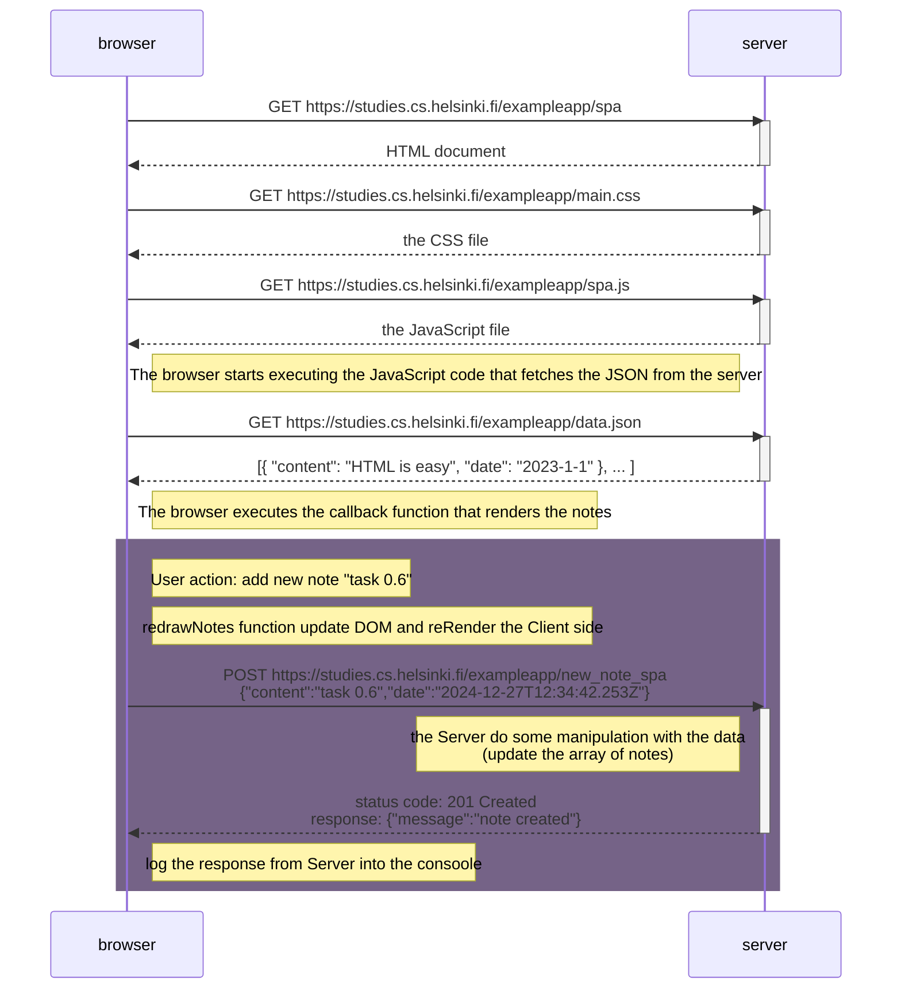

```mermaid

sequenceDiagram
    participant browser
    participant server

    browser->>server: GET https://studies.cs.helsinki.fi/exampleapp/spa
    activate server
    server-->>browser: HTML document
    deactivate server

    browser->>server: GET https://studies.cs.helsinki.fi/exampleapp/main.css
    activate server
    server-->>browser: the CSS file
    deactivate server

    browser->>server: GET https://studies.cs.helsinki.fi/exampleapp/spa.js
    activate server
    server-->>browser: the JavaScript file
    deactivate server

    Note right of browser: The browser starts executing the JavaScript code that fetches the JSON from the server

    browser->>server: GET https://studies.cs.helsinki.fi/exampleapp/data.json
    activate server
    server-->>browser: [{ "content": "HTML is easy", "date": "2023-1-1" }, ... ]
    deactivate server

    Note right of browser: The browser executes the callback function that renders the notes

    rect rgb(117, 99, 135)

        Note right of browser: User action: add new note "task 0.6"

        Note right of browser: redrawNotes function update DOM and reRender the Client side

        browser->>server: POST https://studies.cs.helsinki.fi/exampleapp/new_note_spa <br>{"content":"task 0.6","date":"2024-12-27T12:34:42.253Z"}
        activate server

        Note left of server: the Server do some manipulation with the data <br>(update the array of notes)
        
        server-->>browser: status code: 201 Created<br>response: {"message":"note created"}
        deactivate server

        Note right of browser: log the response from Server into the consoole
    
    end

```
